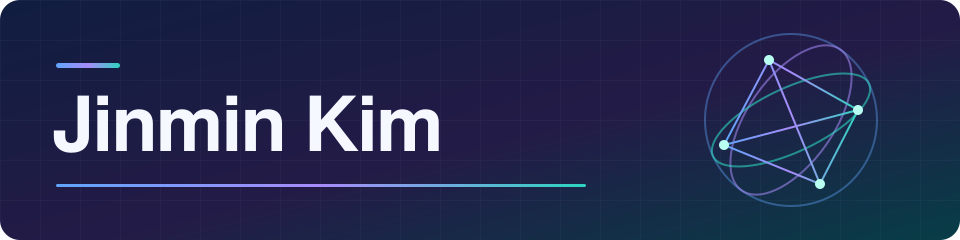

  

[한국어 포트폴리오](https://rafaam11.github.io/)

**From research to working software.**

| About | Details |
|:---|:---|
| 🔭 **Current Work** | Developing a digital occlusion app with Samsung Medical Center, integrating landmarking, occlusion, and evaluation as part of a longer-term collaboration toward oral and maxillofacial surgical planning. |
| 🏢 **Affiliation** | Researcher at **DIGITRACK Inc.** |
| 🎓 **Education** | M.S. in Robotics & Mechatronics Engineering, **DGIST** |
| 🔬 **Interests** | 3D Registration · Medical Imaging · Surgical Navigation · Robot Vision · XR |

## 🚀 Selected Projects

| Project | What I built |
|:---|:---|
| [**Digital Occlusion Workflow**](https://rafaam11.github.io/en/projects/digital-occlusion-workflow/) | As technical lead and primary developer, own the app architecture, end-to-end UI/UX, collaborative engine integration, and evaluation/export pipeline; researcher validation is ongoing. |
| [**SMCNavi**](https://rafaam11.github.io/en/projects/surgical-navigation/) | Designed the architecture and primarily implemented imaging, tracking, registration, calibration, and HoloLens integration in a phantom-tested research platform. |
| [**Autonomous Forklift**](https://rafaam11.github.io/en/projects/unmanned-forklift/) | Implemented multi-sensor registration, localization, sensor fusion, safety-policy decisions, and Zenoh output for the team's integration and field validation. |
| [**AI Build Lab**](https://rafaam11.github.io/en/projects/ai-build-lab/) · [multi-cli-work ↗](https://github.com/rafaam11/multi-cli-work) | Built tools for my own workflows with AI coding agents, owning requirements, architecture, acceptance criteria, tests, and releases. |

### More Projects

| Project | What I built |
|:---|:---|
| [**Mandibular Fracture Reduction Optimization**](https://rafaam11.github.io/en/projects/mandibular-fracture/) | Built a surgical-planning simulator and experiment pipeline optimizing mandibular fragment pose using dental features and fracture surfaces. |
| [**OMFS VR**](https://rafaam11.github.io/en/projects/life-careverse/) | Built a three-user Unity consultation session with Photon PUN2 and Voice, synchronizing a CT-derived jaw model and measurement panel. |
| [**NeuroPilot**](https://rafaam11.github.io/en/projects/rtms-navigation/) | Led the coil-navigation workflow, landmark-and-ICP registration engine, device integration, and license-gated product structure. |
| [**SGRT**](https://rafaam11.github.io/en/projects/respiratory-surface-guidance/) | Lead sensor validation, built the DtDepthScan measurement tool, and own breathing-tracking algorithm development and interfaces; current evidence covers first-year sensor validation. |
| [**SKADI Desktop App & API**](https://rafaam11.github.io/en/projects/skadi-tracking-software/) | Maintain and release the desktop app and API, improve input validation and error handling, and provide public documentation and integration support. |

## 📝 Selected Research

**Joint first author** — [A Proof of Concept: Optimized Jawbone-Reduction Model for Mandibular Fracture Surgery](https://link.springer.com/article/10.1007/s10278-024-01014-z), *Journal of Imaging Informatics in Medicine*, 2024.

**DOI:** [10.1007/s10278-024-01014-z](https://doi.org/10.1007/s10278-024-01014-z)

Jointly led problem definition, optimization design, the simulator, experiments, analysis, and paper.

[Full publications, patents, and awards — CV](https://rafaam11.github.io/en/cv/) · [Download CV (PDF)](https://rafaam11.github.io/assets/cv/jinmin-kim-cv-en.pdf)

## 🧰 Tech & Tools

Primary technologies reflect recent project work; additional experience covers the broader toolkit.

🤖 **AI Tooling**

**Primary:**   

**Additional experience:**  

💻 **Languages**

**Primary:**    

**Additional experience:** 

👁️ **Vision & Perception**

**Primary:**     

**Additional experience:**   

🦾 **Robotics & Simulation**

**Primary:**      

**Additional experience:**  

🥽 **XR / AR**

**Primary:**      

**Additional experience:**  

🩻 **Medical Imaging**

**Primary:**    

🗄️ **Backend & Infra**

**Primary:**      

**Additional experience:**    

📐 **CAD & Hardware**

**Additional experience:**   
